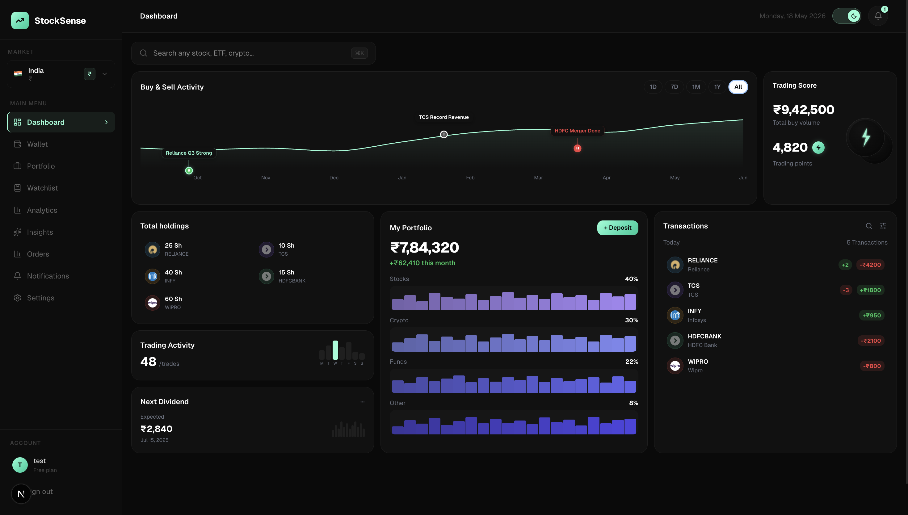
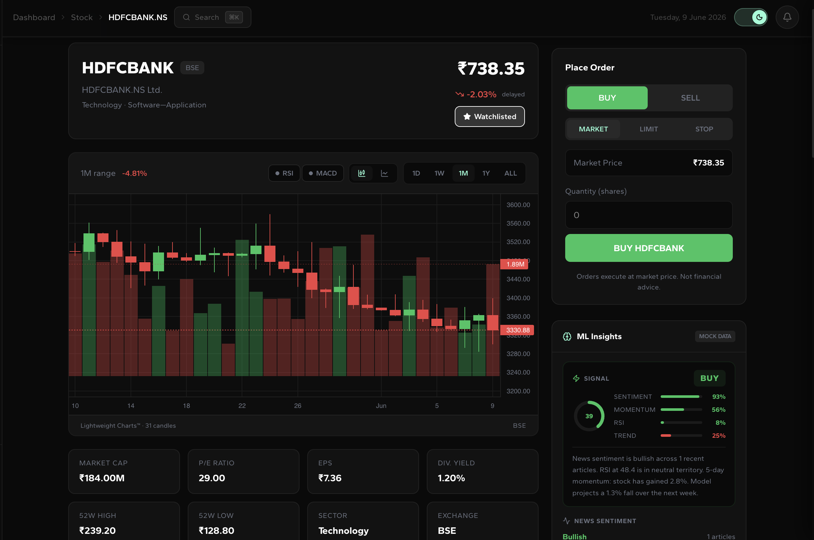
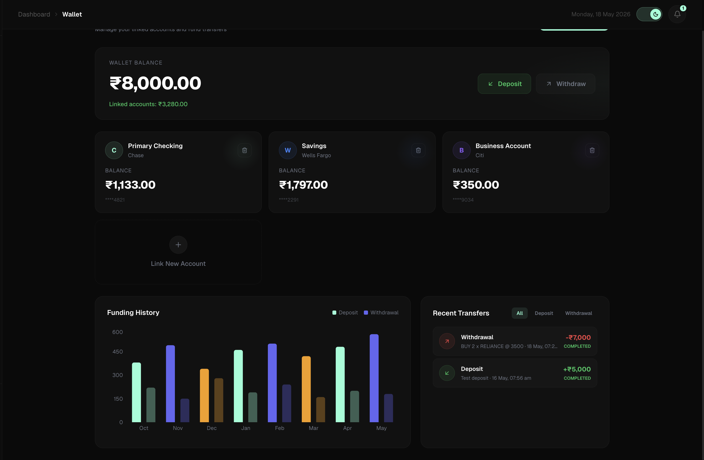
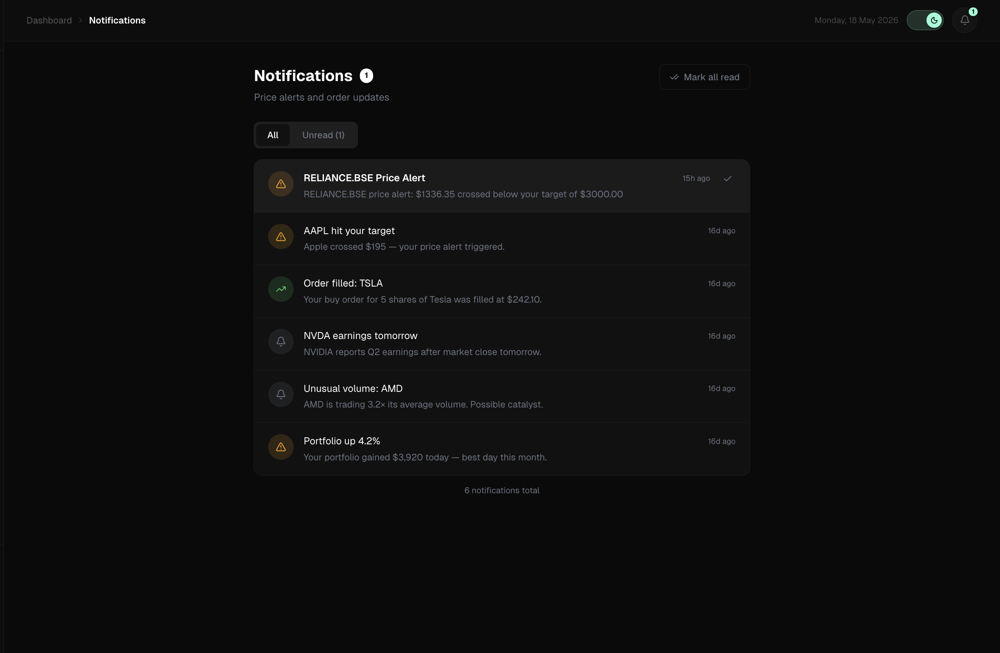
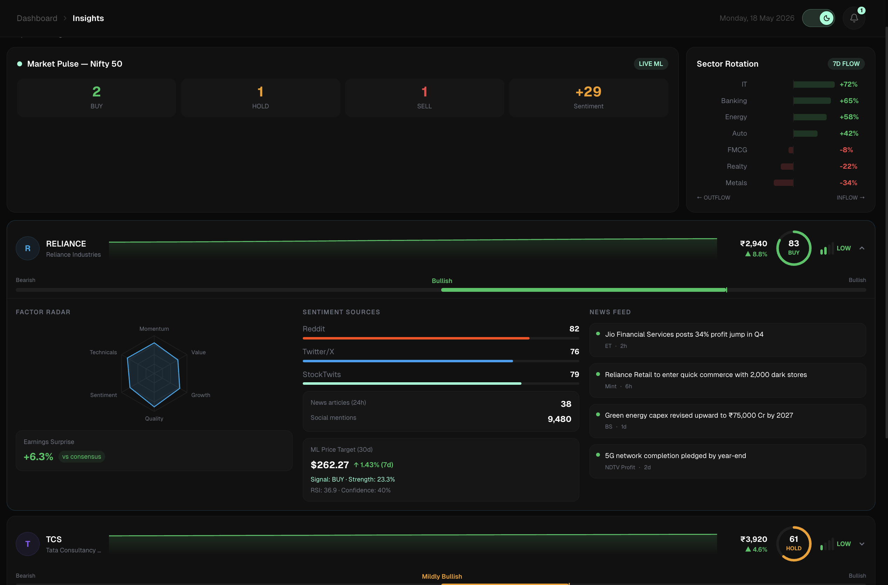

# StockSense 📈

> A full-stack stock trading simulator with real-time prices, ML-powered insights, portfolio management, and multi-market support.

---

## Table of Contents

- [Overview](#overview)
- [Features](#features)
- [Tech Stack](#tech-stack)
- [Architecture](#architecture)
- [Screenshots](#screenshots)
- [Quick Start (Docker)](#quick-start-docker)
- [Local Development](#local-development)
- [Project Structure](#project-structure)
- [API Reference](#api-reference)
- [ML Service](#ml-service)
- [Environment Variables](#environment-variables)
- [Database Schema](#database-schema)
- [Known Limitations](#known-limitations)
- [Roadmap](#roadmap)

---

## Overview

StockSense is a paper trading platform that lets you simulate stock trading across Indian (BSE/NSE), US (NYSE/NASDAQ), Crypto, and FX markets. It pulls real-time price data from Alpha Vantage, analyzes news sentiment via NewsAPI + VADER, and generates ML-powered buy/sell signals using a composite scoring model.

Everything runs locally — no cloud required.

---

## Features

### Trading
- 🏦 **Wallet system** — deposit, withdraw, track balance (persisted to PostgreSQL)
- 📊 **Place orders** — BUY/SELL with automatic wallet debit/credit
- 💰 **Balance validation** — orders rejected if insufficient wallet funds
- 📋 **Order history** — full trade log with status tracking
- 📈 **Portfolio** — real holdings computed from order history, live P&L

### Market Data
- ⚡ **Real-time prices** — Alpha Vantage GLOBAL_QUOTE with 60s TTL cache
- 🕯️ **Candlestick charts** — Lightweight Charts for all markets (1D/1W/1M/1Y/ALL)
- 🔍 **Stock search** — symbol + company name search across all markets
- 📰 **News feed** — per-stock news from NewsAPI with thumbnails and timestamps
- 🌍 **Multi-market** — India (BSE), US (NYSE/NASDAQ), Crypto, FX

### ML Insights (FastAPI)
- 🤖 **Sentiment analysis** — NewsAPI headlines scored with VADER (-1 to +1)
- 📉 **Price prediction** — next-day and next-week forecast via linear regression + RSI
- 🚦 **Buy/Sell/Hold signal** — composite of sentiment (30%), momentum (25%), RSI (25%), trend (20%)
- ⚠️ **Anomaly detection** — Z-score on price and volume vs 20-day average

### Alerts & Notifications
- 🔔 **Price alerts** — set target price on any watchlist item
- ⏱️ **Auto-check** — scheduler runs every 5 minutes, fires notification on crossover
- 📬 **In-app notifications** — bell icon with unread count, mark read/all read

### UI/UX
- 🌙 **Dark/light mode** — full theme support via next-themes
- 🎨 **Figma-matched design** — Gantari design system, accent #8FFFD6
- ✨ **Animations** — page transitions, staggered nav, fadeInUp on all pages
- 📱 **Responsive** — works on desktop (mobile support planned)

---

## Tech Stack

| Layer | Technology |
|-------|-----------|
| Frontend | Next.js 14 (App Router), React, TypeScript |
| Styling | CSS Variables, inline styles, next-themes |
| Charts | Lightweight Charts 4.1.1, Recharts |
| Backend | Spring Boot 3.x, Spring Security, JPA/Hibernate |
| Database | PostgreSQL 16 |
| Auth | JWT (HS256) + HTTP-only refresh token cookies |
| ML Service | FastAPI, scikit-learn, VADER Sentiment, httpx |
| Real-time | Raw WebSocket (ws://localhost:8081/ws/prices) |
| External APIs | Alpha Vantage, NewsAPI |
| DevOps | Docker, Docker Compose |

---

## Architecture

```
┌─────────────────────────────────────────────────────────────┐
│                        Browser                              │
│                    Next.js (port 3000)                      │
│  Dashboard │ Stock │ Portfolio │ Wallet │ Analytics │ ...   │
└──────────────────┬──────────────────────────────────────────┘
                   │ HTTP + WebSocket
        ┌──────────┴──────────┐
        │                     │
        ▼                     ▼
┌──────────────┐     ┌──────────────────┐
│ Spring Boot  │     │  FastAPI ML       │
│  (port 8081) │     │  (port 8082)      │
│              │     │                  │
│ Auth         │     │ /ml/sentiment    │
│ Orders       │     │ /ml/prediction   │
│ Portfolio    │     │ /ml/signal       │
│ Wallet       │     │ /ml/anomaly      │
│ Watchlist    │     │ /ml/full         │
│ Notifications│     └──────┬───────────┘
│ Scheduler    │            │
└──────┬───────┘            │ NewsAPI
       │                    │ Alpha Vantage
       ▼
┌──────────────┐
│  PostgreSQL  │
│  (port 5432) │
│              │
│ users        │
│ orders       │
│ wallet_*     │
│ watchlist    │
│ notifications│
└──────────────┘
       │
       ▼
┌──────────────┐
│ Alpha Vantage│  ← Rate limited (4 calls/min, TTL cache)
│   NewsAPI    │
└──────────────┘
```

---
## Screenshots
1. **Dashboard**

2. **Stock Detail** 

3. **Wallet Page**

4. **Price Alert Notification**

5. **ML Insights Panel**



## Quick Start (Docker)

### Prerequisites
- Docker Desktop installed and running
- API keys for Alpha Vantage and NewsAPI (free tiers work)

### 1. Clone

```bash
git clone <https://github.com/Parth152-create/stocksensel>
cd StockSense
```

### 2. Configure environment

```bash
cp .env.example .env
```

Edit `.env`:

```env
ALPHAVANTAGE_API_KEY=your_key   # https://alphavantage.co/support/#api-key
NEWS_API_KEY=your_key           # https://newsapi.org/register
JWT_SECRET=your_64_char_secret  # run: openssl rand -hex 64
POSTGRES_PASSWORD=your_password
```

### 3. Start everything

```bash
docker compose up --build
```

First run takes 3–5 minutes to build all images. Subsequent starts take ~30 seconds.

### 4. Open the app

```
http://localhost:3000
```

Register an account → get ₹10,000 starting balance → start trading.

### 5. Stop

```bash
docker compose down          # stop containers
docker compose down -v       # stop + delete database
```

---

## Local Development

For faster iteration, run services individually without Docker.

### Prerequisites

- Node.js 20+
- Java 21 + Maven 3.9+
- Python 3.11+
- Docker (PostgreSQL only)

### Step 1 — PostgreSQL

```bash
docker run -d \
  --name stocksense-postgres \
  -e POSTGRES_DB=stocksense \
  -e POSTGRES_USER=postgres \
  -e POSTGRES_PASSWORD=password \
  -p 5432:5432 \
  postgres:16
```

### Step 2 — Backend

```bash
cd backend

# Option A: export env vars
export ALPHAVANTAGE_API_KEY=your_key
export JWT_SECRET=your_secret
./mvnw spring-boot:run

# Option B: use application-local.properties
cat > src/main/resources/application-local.properties << EOF
alphavantage.api.key=your_key
jwt.secret=your_secret
EOF
./mvnw spring-boot:run -Dspring-boot.run.profiles=local
```

Runs on `http://localhost:8081`. Hibernate auto-creates all tables on first start.

### Step 3 — ML Service

```bash
cd ml-service
python -m venv venv
source venv/bin/activate        # Windows: venv\Scripts\activate
pip install -r requirements.txt

# Copy and configure env
cp .env.example .env            # fill in API keys

uvicorn main:app --host 0.0.0.0 --port 8082 --reload
```

Runs on `http://localhost:8082`. Check health: `curl http://localhost:8082/health`

### Step 4 — Frontend

```bash
cd frontend
npm install
npm run dev
```

Runs on `http://localhost:3000`.

---

## Project Structure

```
StockSense/
│
├── frontend/                          # Next.js 14 App Router
│   ├── app/
│   │   ├── dashboard/
│   │   │   ├── layout.tsx             # Auth guard, sidebar, header
│   │   │   ├── page.tsx               # Dashboard with charts + holdings
│   │   │   ├── analytics/page.tsx     # Performance charts, risk gauge
│   │   │   ├── portfolio/page.tsx     # Holdings table, allocation pie
│   │   │   ├── wallet/page.tsx        # Balance, deposit/withdraw, history
│   │   │   ├── watchlist/page.tsx     # Watchlist with price alerts
│   │   │   ├── orders/page.tsx        # Order history
│   │   │   ├── settings/page.tsx      # Profile, password, notifications
│   │   │   ├── insights/page.tsx      # AI market insights
│   │   │   └── stock/[symbol]/page.tsx # Stock detail + ML panel
│   │   ├── login/page.tsx
│   │   ├── register/page.tsx
│   │   ├── layout.tsx                 # Root layout + theme provider
│   │   └── animations.css             # Global animation utilities
│   ├── components/
│   │   ├── MLInsightsPanel.tsx        # Signal/sentiment/prediction/anomaly
│   │   ├── StockSearch.tsx
│   │   ├── MarketSwitcher.tsx
│   │   └── NotificationsDrawer.tsx
│   └── lib/
│       ├── auth.ts                    # JWT, fetchWithAuth, login/logout
│       ├── websocket.ts               # useLivePrices hook
│       ├── MarketContext.tsx          # Market state + formatPrice
│       └── csv-export.ts             # Portfolio/orders CSV export
│
├── backend/                           # Spring Boot 3
│   └── src/main/java/com/stocksense/
│       ├── controller/
│       │   ├── AuthController.java    # /api/auth/*
│       │   ├── UserController.java    # /api/users/me
│       │   ├── StockController.java   # /api/stocks/*, /api/market/*
│       │   ├── OrderController.java   # /api/orders (with wallet validation)
│       │   ├── PortfolioController.java
│       │   ├── WalletController.java  # DB-persisted wallet
│       │   ├── WatchlistController.java
│       │   └── NotificationController.java
│       ├── service/
│       │   ├── AlphaVantageService.java  # Rate-limited + cached API calls
│       │   ├── PortfolioService.java     # Aggregates orders → holdings
│       │   ├── JwtService.java
│       │   └── PriceAlertScheduler.java  # @Scheduled every 5min
│       ├── model/
│       │   ├── User.java
│       │   ├── Order.java
│       │   ├── WalletBalance.java
│       │   ├── WalletTransaction.java
│       │   ├── WatchlistItem.java
│       │   └── Notification.java
│       ├── repository/                # Spring Data JPA
│       └── config/
│           ├── SecurityConfig.java    # JWT filter chain
│           ├── JwtAuthFilter.java
│           └── WebSocketConfig.java
│
├── ml-service/                        # FastAPI
│   ├── main.py                        # Routes + CORS
│   └── services/
│       ├── sentiment.py               # NewsAPI + VADER
│       ├── prediction.py              # Linear regression + RSI
│       ├── signal.py                  # Composite BUY/SELL/HOLD
│       └── anomaly.py                 # Z-score detection
│
├── docker-compose.yml
├── .env.example
└── README.md
```

---

## API Reference

All backend endpoints are on `http://localhost:8081`.

### Auth

| Method | Endpoint | Description |
|--------|----------|-------------|
| POST | `/api/auth/register` | Register new user → `{ token, email }` |
| POST | `/api/auth/login` | Login → `{ token, email }` |
| POST | `/api/auth/refresh` | Rotate refresh token → `{ token, email }` |
| POST | `/api/auth/logout` | Logout |

### User

| Method | Endpoint | Description |
|--------|----------|-------------|
| GET | `/api/users/me` | Get profile `{ id, email, name, provider, createdAt, portfolioId }` |
| PUT | `/api/users/me` | Update name/email |
| PUT | `/api/users/me/password` | Change password |

### Stocks & Market

| Method | Endpoint | Description |
|--------|----------|-------------|
| GET | `/api/stocks/{symbol}` | Real-time quote |
| GET | `/api/stocks/{symbol}/overview` | Fundamentals (P/E, EPS, market cap…) |
| GET | `/api/stocks/{symbol}/history?range=1D\|1W\|1M\|1Y\|ALL` | OHLCV candles |
| GET | `/api/stocks/{symbol}/ratings` | Analyst ratings |
| GET | `/api/stocks/{symbol}/insights` | AI insights |
| GET | `/api/stocks/{symbol}/news` | NewsAPI feed (proxied) |
| GET | `/api/stocks/search?q=` | Symbol search |
| GET | `/api/market/{id}/quotes` | Paginated market quotes |
| GET | `/api/market/{id}/analytics` | Market analytics |

### Orders

| Method | Endpoint | Description |
|--------|----------|-------------|
| GET | `/api/orders` | All orders for current user |
| POST | `/api/orders` | Place order — validates wallet balance |

Order body: `{ symbol, type: "BUY"\|"SELL", qty, price, market }`

Error response if insufficient funds:
```json
{
  "error": "Insufficient wallet balance",
  "required": 35000000,
  "available": 15000.0
}
```

### Wallet

| Method | Endpoint | Description |
|--------|----------|-------------|
| GET | `/api/wallet/balance` | `{ balance, currency, lastUpdated }` |
| POST | `/api/wallet/deposit` | `{ amount }` → `{ success, newBalance, transactionId }` |
| POST | `/api/wallet/withdraw` | `{ amount }` → `{ success, newBalance, transactionId }` |
| GET | `/api/wallet/transactions` | Transaction history |

### Portfolio

| Method | Endpoint | Description |
|--------|----------|-------------|
| GET | `/api/portfolio` | Holdings `[{ symbol, name, qty, avgPrice, currentPrice, marketValue, pnl, pnlPct }]` |
| GET | `/api/portfolio/summary` | `{ totalValue, totalCost, totalPnl, totalPnlPct }` |

### Watchlist

| Method | Endpoint | Description |
|--------|----------|-------------|
| GET | `/api/watchlist` | All watchlist items |
| POST | `/api/watchlist/{symbol}` | Add symbol |
| DELETE | `/api/watchlist/{symbol}` | Remove symbol |

### Notifications

| Method | Endpoint | Description |
|--------|----------|-------------|
| GET | `/api/notifications` | All notifications |
| POST | `/api/notifications/{id}/read` | Mark one read |
| POST | `/api/notifications/read-all` | Mark all read |

---

## ML Service

All ML endpoints are on `http://localhost:8082`.

### Endpoints

| Endpoint | Description |
|----------|-------------|
| `GET /health` | Health check |
| `GET /ml/sentiment/{symbol}` | News sentiment score (-1 to +1) |
| `GET /ml/prediction/{symbol}` | Next-day + next-week price forecast |
| `GET /ml/signal/{symbol}` | BUY/SELL/HOLD composite signal |
| `GET /ml/anomaly/{symbol}` | Z-score anomaly detection |
| `GET /ml/full/{symbol}` | All four in one call (used by frontend) |

### Signal Weights

| Component | Weight | Source |
|-----------|--------|--------|
| Sentiment | 30% | NewsAPI + VADER |
| Momentum | 25% | 5-day price return |
| RSI | 25% | 14-period RSI |
| Trend | 20% | Linear regression next-week |

### Sample Response `/ml/full/AAPL`

```json
{
  "symbol": "AAPL",
  "sentiment": {
    "score": 0.2341,
    "label": "Bullish",
    "article_count": 20,
    "positive": 0.60,
    "negative": 0.15,
    "neutral": 0.25
  },
  "prediction": {
    "current_price": 182.50,
    "next_day": 184.20,
    "next_day_change_pct": 0.93,
    "next_week": 186.10,
    "next_week_change_pct": 1.97,
    "rsi": 58.4,
    "momentum_5d": 2.1,
    "confidence": 72.5
  },
  "signal": {
    "signal": "BUY",
    "strength": 68.4,
    "composite_score": 0.684,
    "reasoning": "News sentiment is bullish across 20 articles..."
  },
  "anomaly": {
    "is_anomaly": false,
    "severity": "normal",
    "summary": "No unusual activity detected."
  }
}
```

---

## Environment Variables

### Root `.env` (Docker Compose)

| Variable | Description | Required | Default |
|----------|-------------|----------|---------|
| `ALPHAVANTAGE_API_KEY` | Alpha Vantage API key | ✅ | `demo` |
| `NEWS_API_KEY` | NewsAPI.org key | ✅ | — |
| `JWT_SECRET` | JWT signing secret (32+ chars) | ✅ | — |
| `POSTGRES_PASSWORD` | PostgreSQL password | ✅ | `password` |
| `GOOGLE_CLIENT_ID` | Google OAuth client ID | ❌ | — |

### Backend `application.properties`

```properties
spring.datasource.url=jdbc:postgresql://localhost:5432/stocksense
spring.datasource.username=postgres
spring.datasource.password=${POSTGRES_PASSWORD}
spring.jpa.hibernate.ddl-auto=update
alphavantage.api.key=${ALPHAVANTAGE_API_KEY}
jwt.secret=${JWT_SECRET}
jwt.expiration=604800000
```

### ML Service `.env`

```env
NEWS_API_KEY=your_key
ALPHA_VANTAGE_KEY=your_key
PORT=8082
```

---

## Database Schema

```sql
-- Core tables (auto-created by Hibernate)

users (id UUID PK, email, name, password, provider, created_at, portfolio_id)
refresh_tokens (id UUID PK, user_id FK, token, expires_at)

orders (id, user_id, symbol, market, type, quantity, price, total, status, created_at)
portfolios (id UUID PK, user_id FK)
holdings (id, portfolio_id FK, symbol, qty, avg_price)

wallet_balances (id UUID PK, user_id FK UNIQUE, balance, currency, updated_at)
wallet_transactions (id UUID PK, user_id FK, type, amount, description, status, created_at)

watchlist_items (id UUID PK, user_id, symbol, alert_price, last_checked_price)
notifications (id UUID PK, user_id, type, title, message, symbol, read, created_at)
```

---

## Known Limitations

| Limitation | Workaround |
|-----------|------------|
| Alpha Vantage free tier: 5 calls/min, 500/day | Rate limiter + TTL cache built in — mock data used as fallback |
| NewsAPI free tier: 100 requests/day | News proxied via backend with 60s cache |
| BSE/NSE real-time prices not available on free Alpha Vantage | Mock prices used for Indian stocks — upgrade to premium for real data |
| WebSocket prices are mock | Real prices update on page load via REST |
| ML predictions use linear regression | Accuracy limited — for educational purposes only |
| No real money — paper trading only | By design |

---

## Roadmap

### Near-term
- [ ] Real NSE/BSE WebSocket prices
- [ ] Email notifications for price alerts
- [ ] Limit orders and stop-loss
- [ ] Mobile responsive layout
- [ ] Number countup animations on dashboard stats

### Medium-term
- [ ] Redis caching for ML sentiment scores
- [ ] LSTM price prediction model
- [ ] Stock screener (filter by P/E, RSI, sector)
- [ ] Portfolio backtesting
- [ ] React Native mobile app

### Long-term
- [ ] Zerodha/Upstox broker API integration (real trading)
- [ ] Stripe subscription billing (Pro tier)
- [ ] Multi-user leaderboard
- [ ] Kubernetes deployment

---

## Contributing

1. Fork the repo
2. Create a feature branch: `git checkout -b feature/my-feature`
3. Commit: `git commit -m 'Add my feature'`
4. Push: `git push origin feature/my-feature`
5. Open a Pull Request

---

## License

MIT — free to use, modify, and distribute.

---

## Acknowledgements

- [Alpha Vantage](https://alphavantage.co) — market data API
- [NewsAPI](https://newsapi.org) — news headlines API
- [Lightweight Charts](https://tradingview.github.io/lightweight-charts/) — charting library
- [VADER Sentiment](https://github.com/cjhutto/vaderSentiment) — NLP sentiment analysis
- [Gantari](https://www.figma.com/community) — UI design inspiration