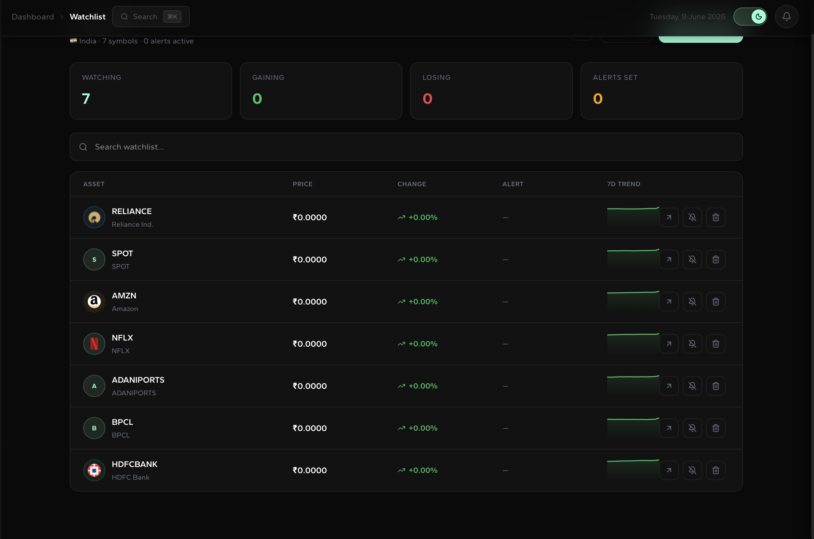
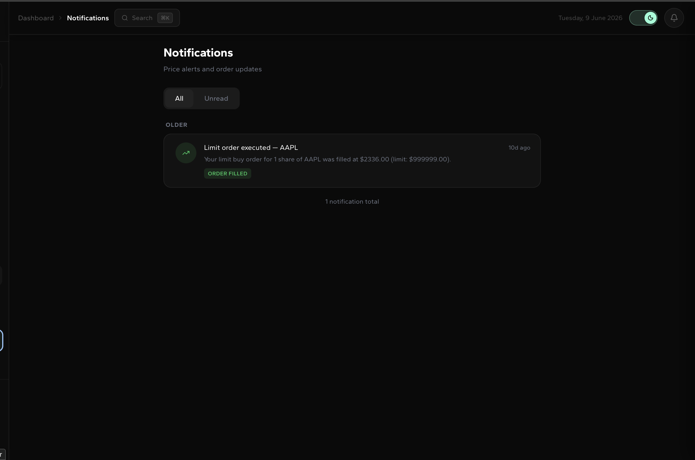

# StockSense 📈

> A production-grade full-stack paper trading platform with real-time prices, ML-powered insights, Redis Pub/Sub WebSocket architecture, and multi-market support. Built to handle 1,000+ concurrent users.

---

## Table of Contents

- [Overview](#overview)
- [Features](#features)
- [Tech Stack](#tech-stack)
- [Architecture](#architecture)
- [Screenshots](#screenshots)
- [Quick Start (Docker)](#quick-start-docker)
- [Local Development](#local-development)
- [Project Structure](#project-structure)
- [API Reference](#api-reference)
- [ML Service](#ml-service)
- [Environment Variables](#environment-variables)
- [Database Schema](#database-schema)
- [Performance & Scalability](#performance--scalability)
- [Known Limitations](#known-limitations)

---

## Overview

StockSense is a paper trading platform that simulates stock trading across Indian (NSE/BSE), US (NYSE/NASDAQ), Crypto, and FX markets. It features a Redis-backed price ingestion pipeline, a WebSocket bridge for real-time price streaming, ML-powered sentiment and anomaly detection, JWT refresh token rotation, and a PostgreSQL backend pooled via PgBouncer.

---

## Features

### Trading
- 🏦 **Wallet system** — deposit, withdraw, track balance persisted to PostgreSQL
- 📊 **Place orders** — BUY/SELL/LIMIT/STOP_LOSS with wallet validation
- 📋 **Order history** — full trade log with status tracking
- 📈 **Portfolio** — real holdings computed from order history, live P&L
- 💸 **Tax lots** — cost basis tracking per position
- 👥 **Copy trading** — mirror another user's trades automatically

### Real-Time Price Architecture
- ⚡ **Price ingestion worker** — `@Scheduled` every 60s, polls all active symbols (union of watchlists + open holdings), writes to Redis `price:{symbol}` with 90s TTL
- 📡 **Redis Pub/Sub bridge** — `RedisWebSocketBridge` subscribes to `prices` channel, fans out to all connected WebSocket sessions subscribed to that symbol
- 🔌 **WebSocket** — `ws://host/ws/prices` — clients subscribe with `{ "action": "subscribe", "symbols": [...] }`, receive instant snapshots + live ticks
- 🌐 **Horizontal scaling ready** — multiple backend instances share price state via Redis, each fans out to its own connected clients independently

### Market Data
- 🕯️ **Candlestick charts** — Lightweight Charts with RSI and MACD indicator panels
- 🔍 **Stock search** — symbol + company name search across all markets
- 📰 **News feed** — per-stock news from NewsAPI with thumbnails and timestamps
- 🌍 **Multi-market** — India (NSE), US (NYSE/NASDAQ), Crypto (CoinGecko), FX

### ML Insights (FastAPI)
- 🤖 **Sentiment analysis** — NewsAPI headlines scored with VADER (-1 to +1)
- 📉 **Price prediction** — next-day and next-week forecast via linear regression + RSI
- 🚦 **Buy/Sell/Hold signal** — composite of sentiment (30%), momentum (25%), RSI (25%), trend (20%)
- ⚠️ **Anomaly detection** — Z-score on price and volume vs 20-day average, wired into price ingestion cycle to auto-notify affected users
- 🔴 **Redis caching** — all ML results cached with per-endpoint TTLs (`ml:prediction:{symbol}:{date}`, `ml:sentiment:{symbol}:{date}`, `ml:anomaly:{symbol}:{date}`)
- ⚙️ **Gunicorn + 4 UvicornWorkers** — non-blocking CPU-bound inference via `ThreadPoolExecutor`

### Alerts & Notifications
- 🔔 **Price alerts** — set target price on any watchlist item
- ⚡ **Executed on every ingestion cycle** — alert checks run every 60s inside `PriceIngestionService`
- 📩 **Email alerts** — fires email via Gmail SMTP on crossover
- 📬 **In-app notifications** — bell icon with unread count, mark read/all read
- 🤖 **Anomaly notifications** — auto-created when ML detects price/volume z-score anomaly

### Security
- 🔐 **JWT refresh tokens** — 15-minute access tokens + 7-day refresh tokens in httpOnly Secure SameSite=Strict cookies
- 🔄 **Silent refresh** — `fetchWithAuth()` intercepts 401s, silently refreshes, retries the original request
- 🛡️ **Auth rate limiting** — `AuthRateLimitFilter` caps `/api/auth/login` and `/api/auth/register` at 10 attempts/IP/min, returns 429 with `Retry-After` header
- 🌐 **CORS lockdown** — globally configured in Spring Security, `localhost:3000` only
- 🔑 **API key system** — `/api/v1/**` routes authenticated via `X-API-Key` header with 60 req/min rate limiting

### Infrastructure
- 🗄️ **PgBouncer** — transaction-mode connection pooling in front of PostgreSQL (1000 max client connections, pool size 20)
- 🗃️ **Database indexes** — covering indexes on `orders(user_id, market)`, `orders(user_id, status)`, `watchlist_items(user_id)`, `notifications(user_id, read)`, `holdings(portfolio_id)`, `portfolios(user_id)`
- 🐢 **Slow query logging** — `log_min_duration_statement = 500ms`
- 📦 **Redis** — 5 Spring cache configs + price ingestion keys + ML result keys

### UI/UX
- 🌙 **Dark/light mode** — full theme support via next-themes
- 🎨 **Gantari design system** — accent `#8FFFD6`, bull `#22c55e`, bear `#ef4444`
- ✨ **Animations** — Framer Motion page transitions, staggered cards, fadeInUp
- 📱 **Mobile responsive** — stock page collapses to single column below 768px
- 🔖 **Dynamic page titles** — stock pages update to `{SYMBOL} · {price} | StockSense` on live price ticks
- 🖥️ **PWA** — installable, offline banner, service worker with cache-first/network-first strategies

---

## Tech Stack

| Layer | Technology |
|-------|-----------|
| Frontend | Next.js 14 (App Router), React, TypeScript |
| Styling | CSS Variables, inline styles, Framer Motion, next-themes |
| Charts | Lightweight Charts 4.1.1, Recharts |
| Backend | Spring Boot 3.x, Spring Security, JPA/Hibernate |
| Connection Pool | PgBouncer (transaction mode) |
| Database | PostgreSQL 16 |
| Cache / Pub-Sub | Redis 7 |
| Auth | JWT HS256 (15min) + httpOnly refresh cookies (7 days) |
| ML Service | FastAPI, Gunicorn + UvicornWorker ×4, scikit-learn, VADER, httpx |
| Real-time | Redis Pub/Sub → RedisWebSocketBridge → WebSocket sessions |
| External APIs | Yahoo Finance, Alpha Vantage, NewsAPI, CoinGecko |
| DevOps | Docker, Docker Compose |

---

## Architecture

```
┌─────────────────────────────────────────────────────────────────┐
│                          Browser                                │
│                      Next.js (port 3000)                        │
│   Dashboard │ Stock │ Portfolio │ Wallet │ Watchlist │ ...      │
└──────────────────────┬──────────────────────────────────────────┘
                       │ HTTPS + WSS
          ┌────────────┴─────────────┐
          │                          │
          ▼                          ▼
┌──────────────────┐       ┌──────────────────┐
│   Spring Boot    │       │   FastAPI ML     │
│   (port 8081)    │       │   (port 8082)    │
│                  │       │   4 workers      │
│  AuthController  │       │                  │
│  StockController │       │ /ml/sentiment    │
│  OrderController │◄─────►│ /ml/prediction   │
│  PortfolioCtrl   │       │ /ml/signal       │
│  WatchlistCtrl   │       │ /ml/anomaly      │
│  NotifController │       │ /ml/full         │
│                  │       └───────┬──────────┘
│  PriceIngestion  │               │
│  Service (60s)   │               │ Redis cache
│       │          │               │ ml:*:{symbol}:{date}
│       ▼          │               │
│  Redis Pub/Sub ──┼───────────────┘
│  "prices" ch.    │
│       │          │
│  RedisWS Bridge──┼──► WebSocket sessions
│                  │
└────────┬─────────┘
         │
         ▼
┌──────────────────┐
│    PgBouncer     │  ← transaction pool, 1000 max conn
│    (port 5433)   │
└────────┬─────────┘
         │
         ▼
┌──────────────────┐     ┌──────────────────┐
│   PostgreSQL 16  │     │     Redis 7      │
│   (port 5432)    │     │   (port 6379)    │
│                  │     │                  │
│  users           │     │  price:{symbol}  │
│  orders          │     │  ss:stockQuote:* │
│  holdings        │     │  ss:stockHistory:│
│  portfolios      │     │  ml:prediction:* │
│  wallet_*        │     │  ml:sentiment:*  │
│  watchlist_items │     │  ml:anomaly:*    │
│  notifications   │     │  prices channel  │
│  refresh_tokens  │     │                  │
│  api_keys        │     └──────────────────┘
└──────────────────┘
```

### Price Flow (real-time)

```
Yahoo Finance / Alpha Vantage
         │
         ▼ every 60s
PriceIngestionService
  ├── writes  →  Redis price:{symbol}  (90s TTL)
  ├── checks  →  price alerts → NotificationService
  ├── checks  →  ML anomaly   → NotificationService
  └── publishes → Redis "prices" channel
                        │
                        ▼
              RedisWebSocketBridge (MessageListener)
                        │
                        ▼
              All connected WebSocket sessions
              subscribed to that symbol
```

---

## Screenshots

1. **Dashboard**


2. **Stock Detail Page**


3. **Wallet Page**


4. **Watchlist**


5. **ML Insights Panel**


6. **Notifications**


---

## Quick Start (Docker)

### Prerequisites
- Docker Desktop installed and running
- API keys for Alpha Vantage and NewsAPI (free tiers work)

### 1. Clone

```bash
git clone https://github.com/Parth152-create/stocksense
cd StockSense
```

### 2. Configure environment

```bash
cp .env.example .env
```

Edit `.env`:

```env
ALPHAVANTAGE_API_KEY=your_key   # https://alphavantage.co/support/#api-key
NEWS_API_KEY=your_key           # https://newsapi.org/register
JWT_SECRET=your_64_char_secret  # run: openssl rand -hex 64
POSTGRES_PASSWORD=your_password
```

### 3. Create PgBouncer config files

```bash
mkdir -p pgbouncer
cat > pgbouncer/pgbouncer.ini << 'PGEOF'
[databases]
stocksense = host=postgres port=5432 dbname=stocksense

[pgbouncer]
listen_addr = 0.0.0.0
listen_port = 5432
auth_type    = md5
auth_file    = /etc/pgbouncer/userlist.txt
pool_mode         = transaction
max_client_conn   = 1000
default_pool_size = 20
min_pool_size     = 5
reserve_pool_size = 5
server_reset_query = DISCARD ALL
ignore_startup_parameters = extra_float_digits
PGEOF

echo '"postgres" "your_password"' > pgbouncer/userlist.txt
```

> Replace `your_password` with the value you set in `.env` for `POSTGRES_PASSWORD`.

### 4. Start everything

```bash
docker compose up --build
```

First run takes 3–5 minutes to build all images. Subsequent starts take ~30 seconds.

### 5. Open the app

```
http://localhost:3000
```

Register an account → deposit funds → start trading.

### 6. Stop

```bash
docker compose down          # stop containers
docker compose down -v       # stop + delete all data
```

---

## Local Development

### Prerequisites

- Node.js 20+
- Java 21 + Maven 3.9+
- Python 3.11+
- Docker (for PostgreSQL + Redis)

### Step 1 — PostgreSQL + Redis + PgBouncer

```bash
docker compose up postgres redis pgbouncer -d
```

### Step 2 — Backend

```bash
cd backend
export ALPHAVANTAGE_API_KEY=your_key
export JWT_SECRET=your_secret
./mvnw spring-boot:run
```

Runs on `http://localhost:8081`.

### Step 3 — ML Service

```bash
cd ml-service
python -m venv venv
source venv/bin/activate
pip install -r requirements.txt
cp .env.example .env   # fill in API keys
uvicorn main:app --host 0.0.0.0 --port 8082 --reload
```

Runs on `http://localhost:8082`.

### Step 4 — Frontend

```bash
cd frontend
npm install
npm run dev
```

Runs on `http://localhost:3000`.

---

## Project Structure

```
StockSense/
│
├── frontend/
│   ├── app/
│   │   ├── dashboard/
│   │   │   ├── layout.tsx             # Auth guard, sidebar, header
│   │   │   ├── page.tsx               # Bento grid dashboard
│   │   │   ├── analytics/page.tsx     # Performance charts
│   │   │   ├── portfolio/page.tsx     # Holdings table, allocation
│   │   │   ├── wallet/page.tsx        # Balance, deposit/withdraw
│   │   │   ├── watchlist/page.tsx     # Watchlist + price alerts
│   │   │   ├── orders/page.tsx        # Order history
│   │   │   ├── settings/page.tsx      # Profile, password, preferences
│   │   │   ├── community/page.tsx     # Leaderboard, copy trading
│   │   │   └── stock/[symbol]/page.tsx # Stock detail + ML panel
│   │   ├── login/page.tsx
│   │   └── register/page.tsx
│   ├── components/
│   │   ├── MLInsightsPanel.tsx        # Signal/sentiment/prediction/anomaly
│   │   ├── PriceAlertPanel.tsx        # Set/manage price alerts
│   │   ├── NotificationsDrawer.tsx    # Bell icon + notification list
│   │   └── ToastContext.tsx           # Global toast notifications
│   ├── lib/
│   │   ├── auth.ts                    # JWT, fetchWithAuth, silent refresh
│   │   ├── websocket.ts               # useLivePrices hook
│   │   ├── MarketContext.tsx          # Market state + formatPrice
│   │   └── symbols.ts                 # resolveSymbol (single source of truth)
│   └── public/
│       └── sw.js                      # Service worker (DEBUG-gated logging)
│
├── backend/
│   └── src/main/java/com/stocksense/
│       ├── controller/
│       │   ├── AuthController.java    # /api/auth/* + refresh/logout
│       │   ├── StockController.java   # /api/stocks/* + anomaly insights
│       │   ├── OrderController.java
│       │   ├── PortfolioController.java
│       │   ├── WalletController.java
│       │   ├── WatchlistController.java
│       │   └── NotificationController.java
│       ├── service/
│       │   ├── PriceIngestionService.java  # Scheduled 60s worker
│       │   ├── StockService.java           # Redis-first quote reads
│       │   ├── NotificationService.java
│       │   ├── RefreshTokenService.java
│       │   └── UserService.java
│       ├── websocket/
│       │   ├── PriceWebSocketHandler.java  # WS session lifecycle
│       │   └── RedisWebSocketBridge.java   # Redis → WebSocket fan-out
│       └── config/
│           ├── SecurityConfig.java         # CORS + filter chain
│           ├── JwtAuthFilter.java
│           ├── AuthRateLimitFilter.java     # 10 req/IP/min on auth endpoints
│           ├── ApiKeyFilter.java            # 60 req/min on /api/v1/*
│           ├── CacheConfig.java             # 5 Redis cache configs
│           └── WebSocketConfig.java         # RedisMessageListenerContainer
│
├── ml-service/
│   ├── main.py
│   ├── Dockerfile                     # Gunicorn + 4 UvicornWorkers
│   └── services/
│       ├── redis_cache.py             # Shared Redis helper + TTLCache fallback
│       ├── sentiment.py               # NewsAPI + VADER + Redis cache
│       ├── prediction.py              # Linear regression + Redis cache
│       ├── signal.py                  # Composite BUY/SELL/HOLD
│       └── anomaly.py                 # Z-score detection + Redis cache
│
├── pgbouncer/
│   ├── pgbouncer.ini                  # Transaction pool config
│   └── userlist.txt                   # Auth credentials
│
├── docker-compose.yml
├── .env.example
└── README.md
```

---

## API Reference

All backend endpoints are on `http://localhost:8081`.

### Auth

| Method | Endpoint | Description |
|--------|----------|-------------|
| POST | `/api/auth/register` | Register → `{ token, email }` + sets `refreshToken` cookie |
| POST | `/api/auth/login` | Login → `{ token, email }` + sets `refreshToken` cookie |
| POST | `/api/auth/refresh` | Rotate refresh token → new access token |
| POST | `/api/auth/logout` | Clear refresh token cookie |
| POST | `/api/auth/google` | Google OAuth → `{ token, email }` |

> Auth endpoints are rate-limited to **10 requests/IP/min**. Exceeding returns `429 Too Many Requests` with `Retry-After` header.

### Stocks & Market

| Method | Endpoint | Description |
|--------|----------|-------------|
| GET | `/api/stocks/{symbol}` | Real-time quote (Redis-first, API fallback) |
| GET | `/api/stocks/{symbol}/history?range=` | OHLCV candles (1D/1W/1M/1Y/ALL) |
| GET | `/api/stocks/{symbol}/overview` | Fundamentals |
| GET | `/api/stocks/{symbol}/insights` | AI insights + live anomaly from ML service |
| GET | `/api/stocks/{symbol}/news` | NewsAPI feed |
| GET | `/api/stocks/search?q=` | Symbol search |

### Orders

| Method | Endpoint | Description |
|--------|----------|-------------|
| GET | `/api/orders` | All orders |
| POST | `/api/orders` | Place order (validates wallet balance) |

### Wallet

| Method | Endpoint | Description |
|--------|----------|-------------|
| GET | `/api/wallet/balance` | Current balance |
| POST | `/api/wallet/deposit` | Deposit funds |
| POST | `/api/wallet/withdraw` | Withdraw funds |
| GET | `/api/wallet/transactions` | Transaction history |

### Watchlist

| Method | Endpoint | Description |
|--------|----------|-------------|
| GET | `/api/watchlist` | All watchlist items |
| POST | `/api/watchlist/{symbol}` | Add symbol |
| DELETE | `/api/watchlist/{symbol}` | Remove symbol |
| PUT | `/api/watchlist/{symbol}/alert` | Set price alert |
| POST | `/api/watchlist/share` | Generate share token |
| DELETE | `/api/watchlist/share` | Revoke share token |
| GET | `/api/watchlist/shared/{token}` | Public view (no auth) |

### Notifications

| Method | Endpoint | Description |
|--------|----------|-------------|
| GET | `/api/notifications` | All notifications |
| POST | `/api/notifications/{id}/read` | Mark one read |
| POST | `/api/notifications/read-all` | Mark all read |

---

## ML Service

All ML endpoints are on `http://localhost:8082`. JWT-gated (pass `Authorization: Bearer {token}`).

### Endpoints

| Endpoint | Cache TTL | Description |
|----------|-----------|-------------|
| `GET /health` | — | Health check |
| `GET /ml/sentiment/{symbol}` | 1 hour | News sentiment score (-1 to +1) |
| `GET /ml/prediction/{symbol}` | 1 hour | Next-day + next-week price forecast |
| `GET /ml/signal/{symbol}` | — | BUY/SELL/HOLD composite signal |
| `GET /ml/anomaly/{symbol}` | 30 min | Z-score anomaly detection |
| `GET /ml/full/{symbol}` | — | All four in one call |

### Signal Weights

| Component | Weight | Source |
|-----------|--------|--------|
| Sentiment | 30% | NewsAPI + VADER |
| Momentum | 25% | 5-day price return |
| RSI | 25% | 14-period RSI |
| Trend | 20% | Linear regression slope |

### Sample Response `/ml/full/AAPL`

```json
{
  "symbol": "AAPL",
  "sentiment": {
    "score": 0.2341,
    "label": "Bullish",
    "article_count": 20,
    "positive": 0.60,
    "negative": 0.15,
    "neutral": 0.25
  },
  "prediction": {
    "current_price": 182.50,
    "next_day": 184.20,
    "next_day_change_pct": 0.93,
    "next_week": 186.10,
    "next_week_change_pct": 1.97,
    "rsi": 58.4,
    "momentum_5d": 2.1,
    "confidence": 72.5
  },
  "signal": {
    "signal": "BUY",
    "strength": 68.4,
    "composite_score": 0.684,
    "reasoning": "News sentiment is bullish across 20 articles..."
  },
  "anomaly": {
    "is_anomaly": false,
    "severity": "normal",
    "summary": "No unusual activity detected."
  }
}
```

---

## Environment Variables

| Variable | Required | Description |
|----------|----------|-------------|
| `ALPHAVANTAGE_API_KEY` | ✅ | Alpha Vantage key (free tier works) |
| `NEWS_API_KEY` | ✅ | NewsAPI.org key |
| `JWT_SECRET` | ✅ | 32+ char signing secret |
| `POSTGRES_PASSWORD` | ✅ | PostgreSQL password |
| `GOOGLE_CLIENT_ID` | ❌ | Google OAuth (optional) |
| `SENTRY_BACKEND_DSN` | ❌ | Sentry error tracking |
| `SENTRY_FRONTEND_DSN` | ❌ | Sentry frontend tracking |
| `STRIPE_SECRET_KEY` | ❌ | Stripe billing (optional) |
| `RAZORPAY_KEY_ID` | ❌ | Razorpay billing (optional) |

---

## Database Schema

```sql
users           (id UUID PK, email, name, password, provider, created_at, portfolio_id)
refresh_tokens  (id UUID PK, user_id FK, token, expires_at)
api_keys        (id UUID PK, user_id FK, key_hash, created_at)

portfolios      (id UUID PK, user_id FK)
holdings        (id UUID PK, portfolio_id FK, symbol, market, quantity, buy_price)
orders          (id, user_id, symbol, market, type, kind, quantity, price, total,
                 limit_price, status, created_at, triggered_at)

wallet_balances      (id UUID PK, user_id FK UNIQUE, balance, currency, updated_at)
wallet_transactions  (id UUID PK, user_id FK, type, amount, description, status, created_at)

watchlist_items (id UUID PK, user_id, symbol, alert_price, last_checked_price,
                 share_token, shared BOOLEAN)
notifications   (id UUID PK, user_id, type, title, message, symbol, read, created_at)
```

### Indexes

```sql
idx_orders_user_market       ON orders(user_id, market)
idx_orders_user_status       ON orders(user_id, status)
idx_watchlist_items_user_id  ON watchlist_items(user_id)
idx_notifications_user_read  ON notifications(user_id, read)
idx_holdings_portfolio_id    ON holdings(portfolio_id)
idx_portfolios_user_id       ON portfolios(user_id)
```

---

## Performance & Scalability

| Metric | Value |
|--------|-------|
| Concurrent users (comfortable) | ~300 |
| Concurrent users (max before degradation) | ~1,000 |
| WebSocket bottleneck | Single backend instance, ~200 Tomcat threads |
| Price ingestion cycle | 60s, all active symbols in one pass |
| PgBouncer max connections | 1,000 clients → 20 PostgreSQL connections |
| ML cache hit rate | ~95% in normal trading hours (1hr TTL) |
| Access token lifetime | 15 minutes |
| Refresh token lifetime | 7 days (rotated on each use) |

To scale beyond 1,000 concurrent users: add Nginx + 3 backend replicas — each instance independently receives prices via Redis and fans out to its own WebSocket clients.

---

## Known Limitations

| Limitation | Notes |
|-----------|-------|
| Alpha Vantage free tier: 25 calls/day | Rate limiter + Redis cache + Yahoo Finance fallback built in |
| NSE/BSE real-time prices | Yahoo Finance `.NS` suffix used; quality varies |
| ML predictions use linear regression | Educational purposes only — not financial advice |
| Single backend replica | Horizontal scaling config ready (see architecture) |
| No real money | Paper trading only — by design |

---

## License

MIT — free to use, modify, and distribute.

---

## Acknowledgements

- [Yahoo Finance](https://finance.yahoo.com) — primary market data source
- [Alpha Vantage](https://alphavantage.co) — fallback market data
- [CoinGecko](https://coingecko.com) — crypto prices
- [NewsAPI](https://newsapi.org) — news headlines
- [Lightweight Charts](https://tradingview.github.io/lightweight-charts/) — charting
- [VADER Sentiment](https://github.com/cjhutto/vaderSentiment) — NLP sentiment
- [PgBouncer](https://pgbouncer.org) — connection pooling